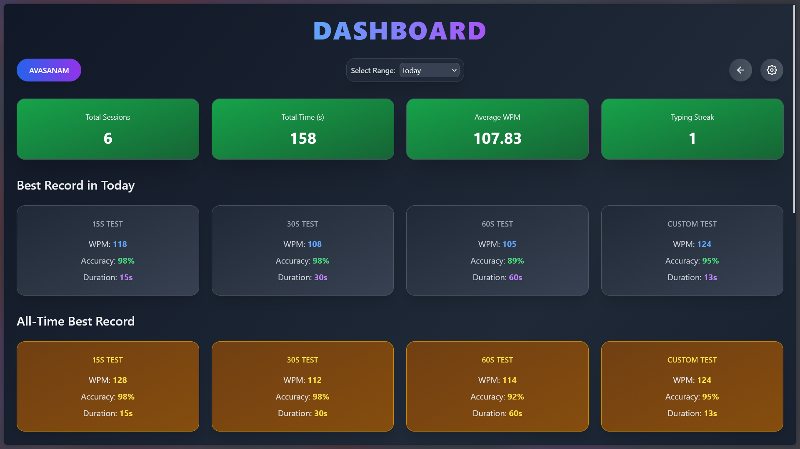
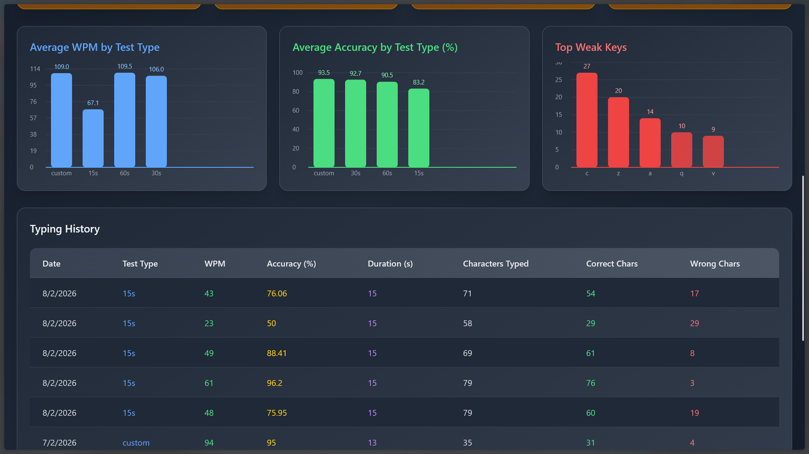
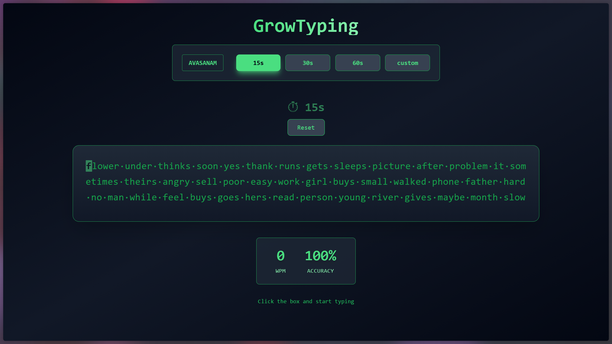
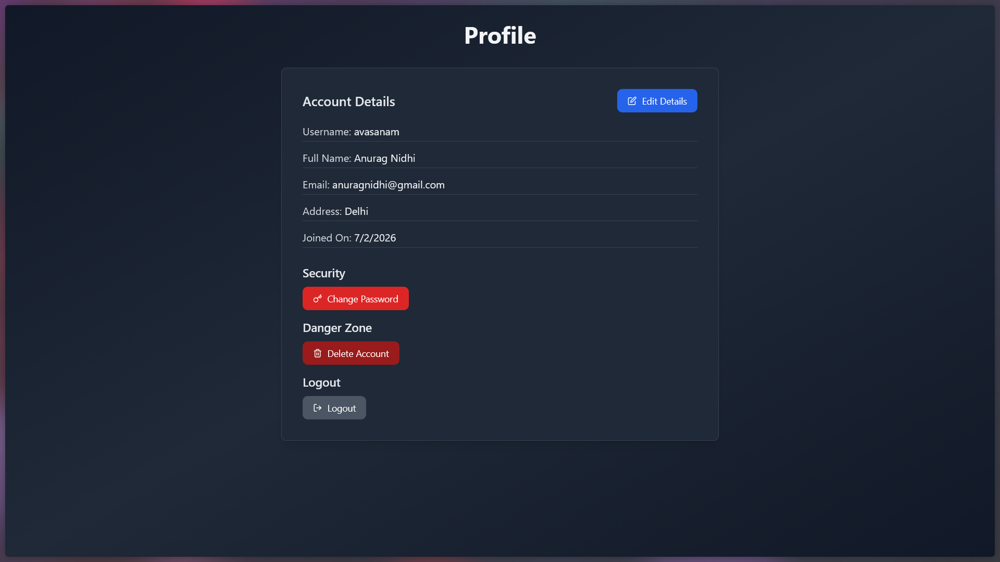
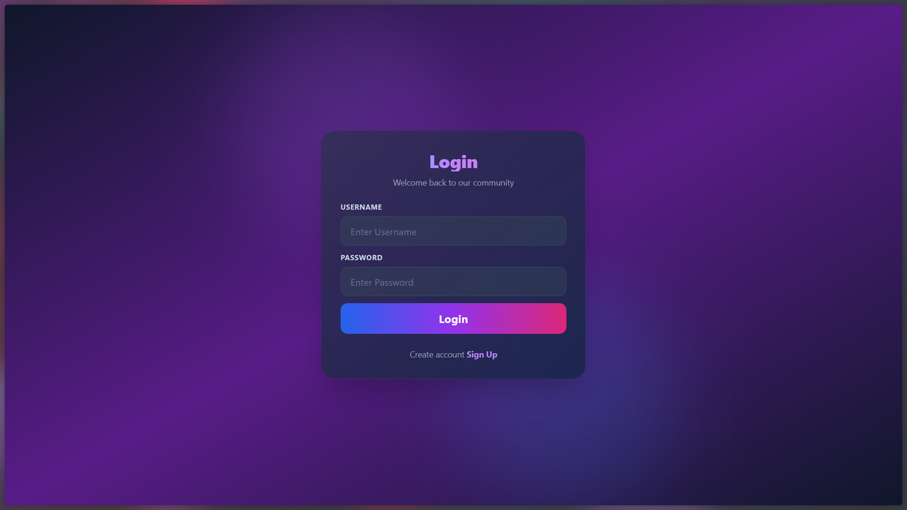
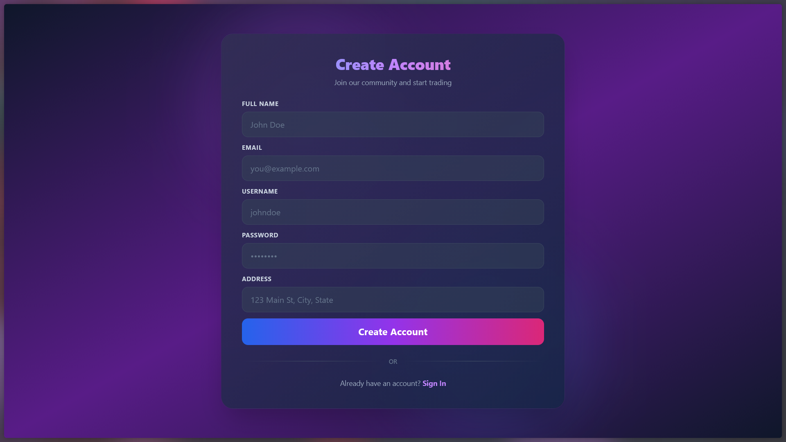

# GrowTyping


## **Project Overview**
**GrowTyping** is a full-stack typing practice and analytics web application designed to help users improve their typing speed, accuracy, and overall performance. The platform provides an interactive environment where users can take timed typing tests with real English words, track their live performance, and analyze detailed statistics over time.

The application emphasizes realistic typing behavior, including penalties for corrections and accurate tracking of WPM (words per minute) and typing accuracy. The project is built using modern web development technologies with a **React frontend** and a **Node.js/Express backend**, storing user and test data in **MongoDB**.

---

## **Key Features**
- Multiple typing test durations: 15s, 30s, 60s, and custom.
- Real English words including articles, pronouns, verbs, nouns, adjectives, adverbs, prepositions, and common phrases.
- Live WPM and accuracy calculation.
- Backspace functionality only corrects wrong characters and deducts accuracy.
- Thin, blinking typing cursor for a professional typing experience.
- Highlighting of correct and incorrect characters during typing.
- Session handling with user authentication.
- Save typing statistics including correct characters, incorrect characters, weak keys, WPM, and accuracy.
- Responsive and visually appealing UI with gradient themes and hover effects.

---

## **Tech Stack**
- **Frontend:** React, TailwindCSS
- **Backend:** Node.js, Express.js
- **Database:** MongoDB Atlas (NoSQL)
- **HTTP Client:** Axios
- **Routing:** React Router
- **Authentication & Session Management:** JWT or cookies


---
## **Preview**
### **Dashboard**
 
 
### **Typing Test**
 
### **Profile**
 
### **Login and Registration**
 
 


## **Frontend Details**
The frontend is designed with a focus on usability and realistic typing experience:

### **Components & Structure**
1. **TypingPage Component**
   - Handles the entire typing test UI.
   - Displays text to type, stats, timer, and user information.
   - Manages key events (typing and backspace).

2. **Word Bank**
   - Curated array of real English words.
   - Randomly generates test text for each session.

3. **Timer**
   - Starts automatically on the first keystroke.
   - Counts down based on selected test type.
   - Stops typing when time ends.

4. **Typing Logic**
   - Tracks correct, incorrect, and total keystrokes.
   - Penalizes accuracy for corrections.
   - Highlights correct letters in green, incorrect letters in red.
   - Thin blinking cursor indicates the current typing position.

5. **Stats Display**
   - Real-time WPM and accuracy calculation.
   - Updates dynamically as the user types.

6. **UI/UX**
   - Responsive and modern design using TailwindCSS.
   - Gradient backgrounds, hover effects, and animated stats.
   - Focused on readability and minimal distractions for typing practice.

---

## **Backend Details**
The backend provides secure and reliable data storage, user management, and typing analytics:

### **Server & Routes**
- **Server:** Express.js server running on Node.js
- **Routes:**
  1. **`/users/getUsername`**
     - Fetches the current authenticated user's username.
     - Handles session expiration and redirects unauthorized users to login.
  2. **`/stats/save`**
     - Saves typing test results including WPM, accuracy, duration, correct/incorrect characters, and weak keys.
     - Ensures each test is only saved once per session.

### **Database**
- **MongoDB (Atlas)**
  - Stores user information and typing statistics.
  - Provides scalability and reliability for user data storage.

### **Logic**
- Calculates WPM using: `correct characters / 5 / minutes elapsed`.
- Accuracy calculated based on total keystrokes and corrected mistakes.
- Tracks “weak keys” for each user to help identify typing difficulties.
- Prevents double saving of stats per test.

---

## **How It Works**
1. User logs in and accesses the typing test page.
2. User selects a typing test duration or uses the default/custom test.
3. Random English text is generated from the word bank.
4. User begins typing:
   - Correct characters are highlighted in green.
   - Incorrect characters are highlighted in red.
   - Backspacing only removes incorrect characters and deducts accuracy.
5. The timer counts down, and stats are updated live.
6. At the end of the test, results are automatically saved to the backend.
7. Users can review their WPM, accuracy, and weak keys for improvement.


---

## **Setup Instructions**
### **Frontend**
1. Clone the repository:
   ```bash
   git clone https://github.com/<username>/GrowTyping.git
   cd GrowTyping/frontend
   ```
2. Install dependencies:
   ```bash
   npm install
   ```
3. Create a `.env` file and set your API URL:
   ```
   VITE_REACT_APP_API=http://localhost:8000/GrowTyping/v1
   ```
4. Start the development server:
   ```bash
   npm run dev
   ```

### **Backend**
1. Navigate to backend folder:
   ```bash
   cd ../backend
   ```
2. Install dependencies:
   ```bash
   npm install
   ```
3. Set up environment variables in `.env` (MongoDB URI, JWT secret, etc.).
4. Start the server:
   ```bash
   npm run dev
   ```
5. Backend will run on `http://localhost:8000/GrowTyping/v1` by default.

---

## **Conclusion**
**GrowTyping** is a comprehensive, user-friendly typing practice tool that combines live performance analytics with a realistic typing experience. It is perfect for users looking to improve their typing speed and accuracy while tracking detailed stats over time.

---

