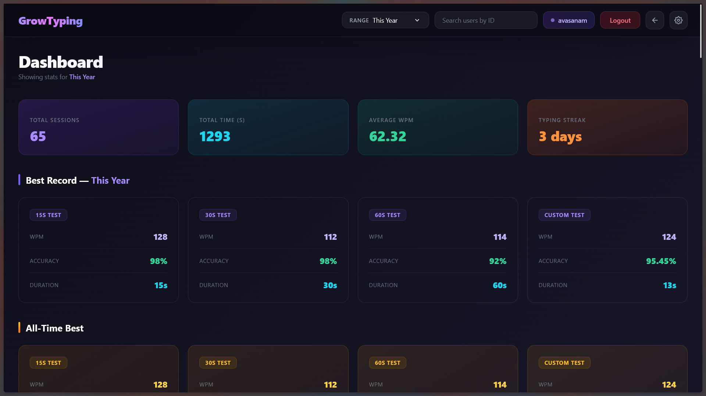
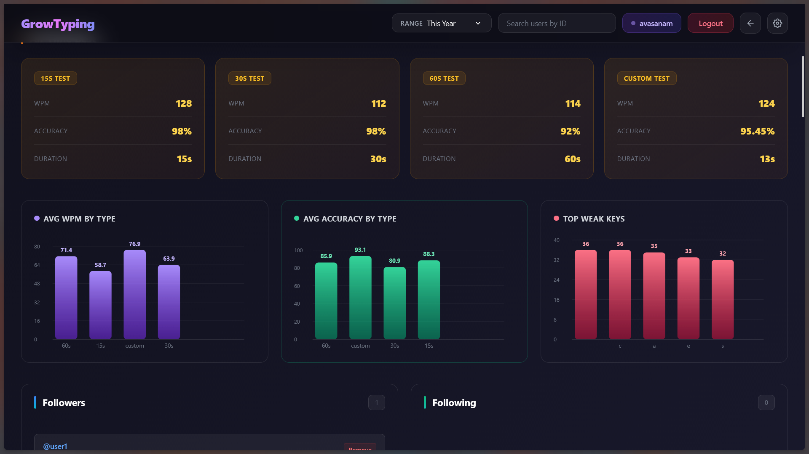
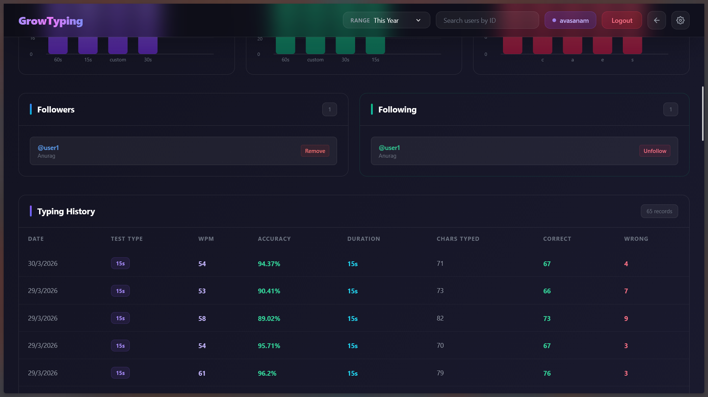
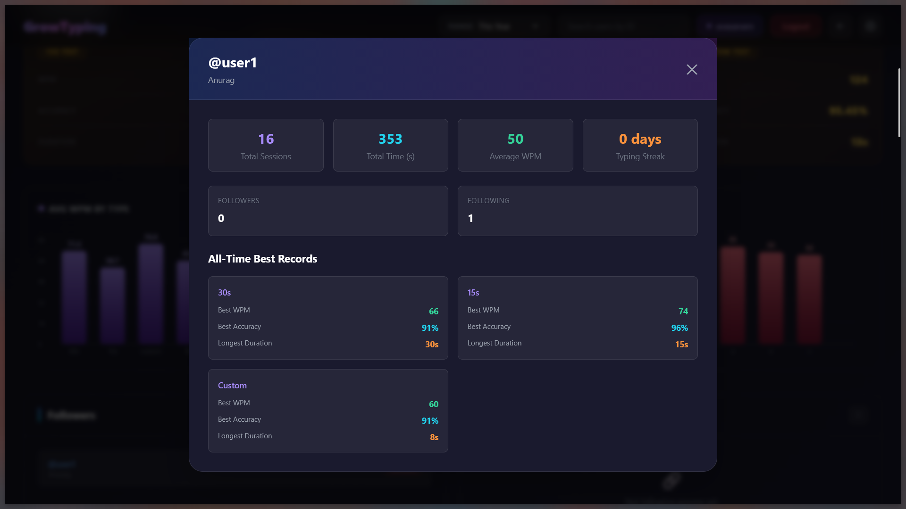
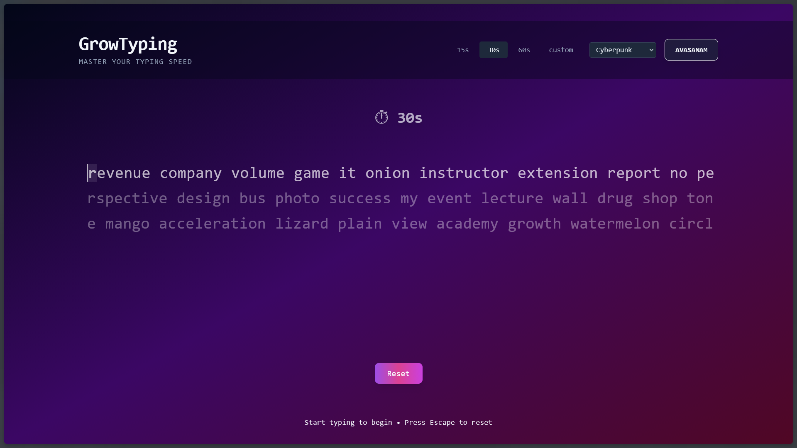
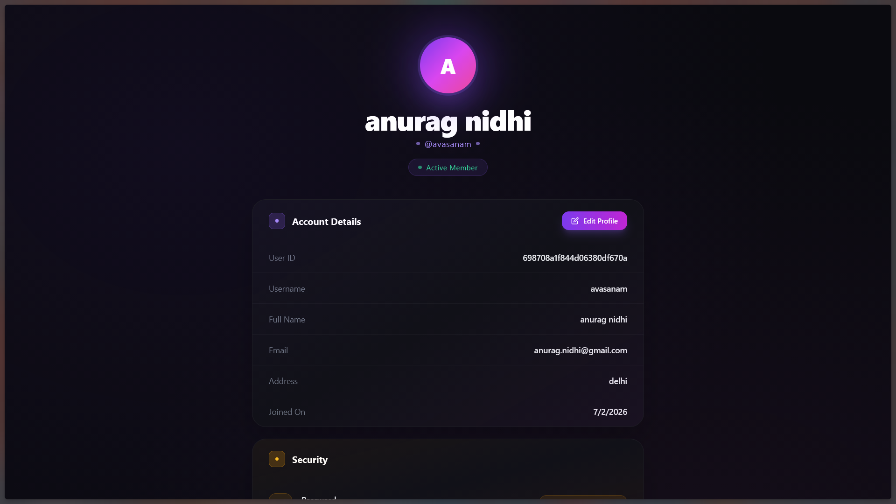
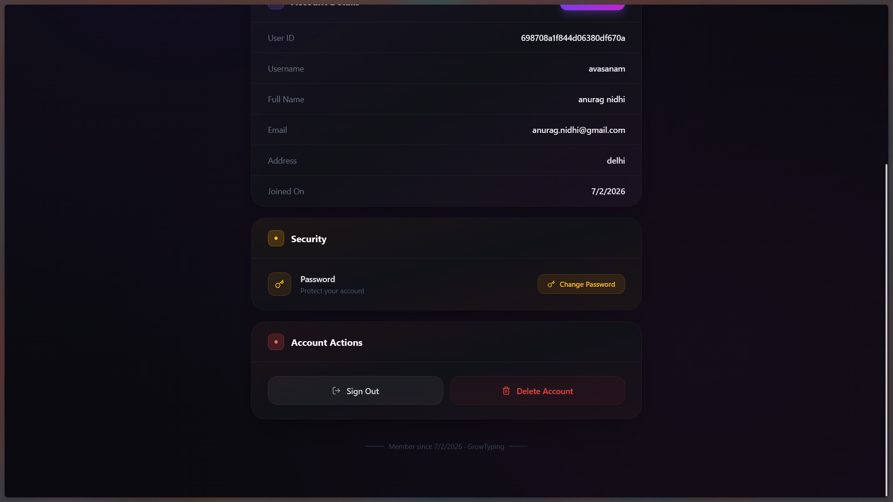
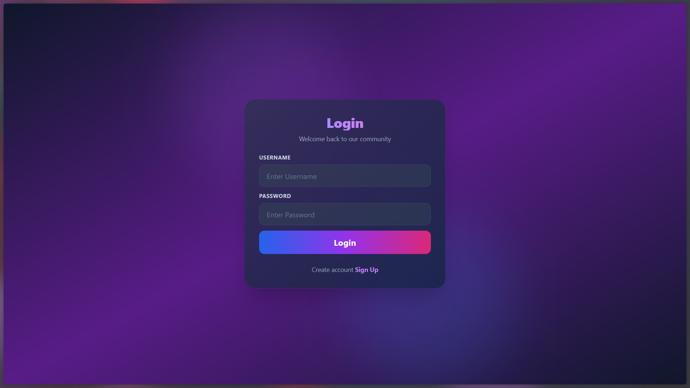
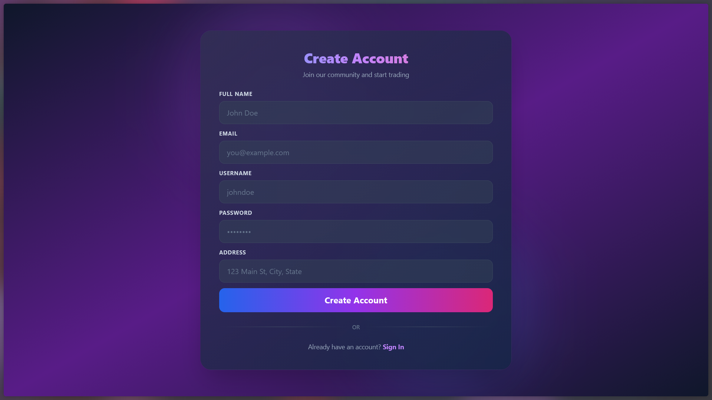

# GrowTyping


### **Live Demo:** [GrowTyping Demo](https://growtyping-1.onrender.com/) || **Demo username and password = Avasanam && 123456789**
If you are registering your account, please check your Spam or Promotions folder for the authentication email, as it may not appear in your primary inbox due to email filtering.

## **Project Overview**
**GrowTyping** is a full-stack typing practice and analytics web application designed to help users improve their typing speed, accuracy, and overall performance. The platform provides an interactive environment where users can take timed typing tests with real English words, track their live performance, and analyze detailed statistics over time.

The application emphasizes realistic typing behavior, including penalties for corrections and accurate tracking of WPM (words per minute) and typing accuracy. The project is built using modern web development technologies with a **React frontend** and a **Node.js/Express backend**, storing user and test data in **MongoDB**.

---

## **Key Features**
- Multiple typing test durations: 15s, 30s, 60s, and custom.
- **Top 5 Weak Keys Analysis:** Identify and display the user's most frequently mistyped keys for targeted improvement.
- Live WPM and accuracy calculation.
- Backspace functionality only corrects wrong characters and deducts accuracy.
- Thin, blinking typing cursor for a professional typing experience.
- Highlighting of correct and incorrect characters during typing.
- **Email Verification:** Users must verify their email before accessing the dashboard and typing tests.
- Save typing statistics including correct characters, incorrect characters, weak keys, WPM, and accuracy.
- **Theme Persistence:** Save and auto-load user's preferred theme from database (16+ custom themes including cyberpunk, contrast, glass morphism, luxury, and professional designs).
- **Social Features:** Follow/Unfollow users, manage followers and following lists with action buttons.
- **Public User Profiles:** View any user's stats, followers, following, and best records without authentication.
- **User Stats Dashboard:** Comprehensive stats modal showing total sessions, time spent, average WPM, typing streak, and all-time best records per test type.


---

## **Tech Stack**
- **Frontend:** React, TailwindCSS
- **Backend:** Node.js, Express.js
- **Database:** MongoDB Atlas (NoSQL)
- **HTTP Client:** Axios
- **Routing:** React Router
- **Authentication & Session Management:** JWT or cookies and nodemailer
- **Deployment:** Render.com or similar hosting service


---
## **Preview**
### **Dashboard**
 
 
 
check friend's profile
 
### **Typing Test**
 
### **Profile**
 
 
### **Login and Registration**
 
 


## **Frontend Details**
The frontend is designed with a focus on usability and realistic typing experience:

### **Components & Structure**
1. **TypingPage Component**
   - Handles the entire typing test UI.
   - Displays text to type, stats, timer, and user information.
   - Manages key events (typing and backspace).

2. **Word Bank**
   - Curated array of real English words.
   - Randomly generates test text for each session.

3. **Timer**
   - Starts automatically on the first keystroke.
   - Counts down based on selected test type.
   - Stops typing when time ends.

4. **Typing Logic**
   - Tracks correct, incorrect, and total keystrokes.
   - Penalizes accuracy for corrections.
   - Highlights correct letters in green, incorrect letters in red.
   - Thin blinking cursor indicates the current typing position.

5. **Stats Display**
   - Real-time WPM and accuracy calculation.
   - Updates dynamically as the user types.

6. **UI/UX**
   - Responsive and modern design using TailwindCSS.
   - Gradient backgrounds, hover effects, and animated stats.
   - Focused on readability and minimal distractions for typing practice.

7. **Dashboard Component**
   - Displays comprehensive typing statistics with date range filtering.
   - Shows stats by test type, accuracy analysis, weak keys, and typing streaks.
   - Displays all-time best records for each test type.

8. **Theme System**
   - 16+ custom themes stored in database and auto-loaded.
   - Real-time theme switching with database persistence.
   - Themes include cyberpunk, contrast modes, glass morphism, luxury, and professional designs.
   - Themes apply to both typing page and dashboard.

9. **Social Features**
   - **Search Users:** Real-time search with loading spinner, supports username and user ID search.
   - **Follow/Unfollow:** Add users to following list with dynamic button states.
   - **Followers/Following Lists:** Manage followers with "Remove" button and following with "Unfollow" button.
   - **User Stats Modal:** Click on any user to view their complete stats dashboard including sessions, time, WPM, streak, and all-time best records.
   - **Self-Follow Prevention:** Alert notification prevents users from following themselves.

---

## **Backend Details**
The backend provides secure and reliable data storage, user management, and typing analytics:

### **Architecture**
- **Server:** Express.js REST API running on Node.js
- **Authentication:** JWT-based authentication with email verification
- **API Structure:** RESTful endpoints organized by resource (users, stats)

### **Core Functionality**
- **User Management:** Registration, login, profile management, theme persistence
- **Social Features:** Follow/Unfollow, user search, public profiles, followers/following management
- **Stats Tracking:** Save typing results, calculate WPM/accuracy, track weak keys, maintain streaks
- **Public APIs:** Public endpoints for user stats and profiles without authentication requirement

### **Database**
- **MongoDB (Atlas)** - Scalable NoSQL database for user data and typing statistics
- **User Collection:** Stores authentication, profile information, theme preference, and social relationships
- **Stats Collection:** Records typing test results with performance metrics (WPM, accuracy, duration, test type)
- **Relationships:** MongoDB references for efficient data retrieval between users and statistics

### **Key Analytics**
- WPM calculation based on correct characters typed per minute
- Accuracy tracking with penalties for corrections
- Weak key identification to highlight typing difficulties
- Typing streak maintenance for user engagement
- Date range filtering for comprehensive statistics analysis

---

## **How It Works**
1. User logs in and accesses the dashboard or typing test page.
2. User's theme preference is auto-loaded from database.
3. On dashboard, user can:
   - View comprehensive typing statistics with date range filtering.
   - Search for other users by username or ID with real-time results.
   - View followers and following lists with action buttons.
   - Click on any user to view their complete stats dashboard.
   - Follow/Unfollow users (with self-follow prevention).
   - Remove followers from their followers list.
   - Change their theme preference (saved to database).

4. For typing tests:
   - User selects a typing test duration or uses the default/custom test.
   - Random English text is generated from the word bank.
   - User begins typing:
     - Correct characters are highlighted in green.
     - Incorrect characters are highlighted in red.
     - Backspacing only removes incorrect characters and deducts accuracy.
   - The timer counts down, and stats are updated live.
   - At the end of the test, results are automatically saved to the backend.
   - Users can review their WPM, accuracy, and weak keys for improvement.

5. Public profile viewing:
   - Any user can view another user's public profile without authentication.
   - Profile displays user's stats, followers/following counts, and all-time best records for each test type.


---

## **Setup Instructions**
### **Frontend**
1. Clone the repository:
   ```bash
   git clone https://github.com/<username>/GrowTyping.git
   cd GrowTyping/frontend
   ```
2. Install dependencies:
   ```bash
   npm install
   ```
3. Create a `.env` file and set your API URL:
   ```
   VITE_REACT_APP_API=http://localhost:8000/GrowTyping/v1
   ```
4. Start the development server:
   ```bash
   npm run dev
   ```

### **Backend**
1. Navigate to backend folder:
   ```bash
   cd ../backend
   ```
2. Install dependencies:
   ```bash
   npm install
   ```
3. Set up environment variables in `.env` (MongoDB URI, JWT secret, etc.).
4. Start the server:
   ```bash
   npm run dev
   ```
5. Backend will run on `http://localhost:8000/GrowTyping/v1` by default.

---

## **Conclusion**
**GrowTyping** is a comprehensive, user-friendly typing practice tool that combines live performance analytics with a realistic typing experience. It is perfect for users looking to improve their typing speed and accuracy while tracking detailed stats over time.

---

